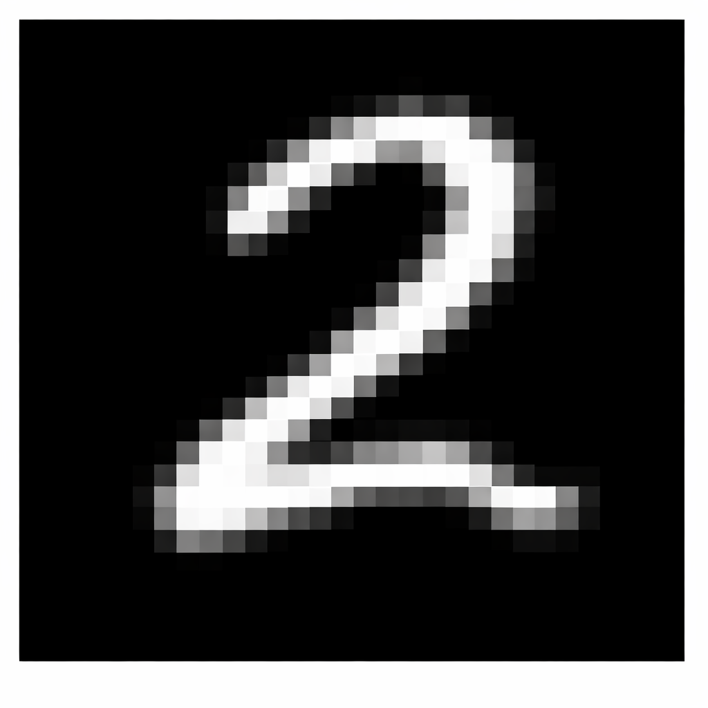
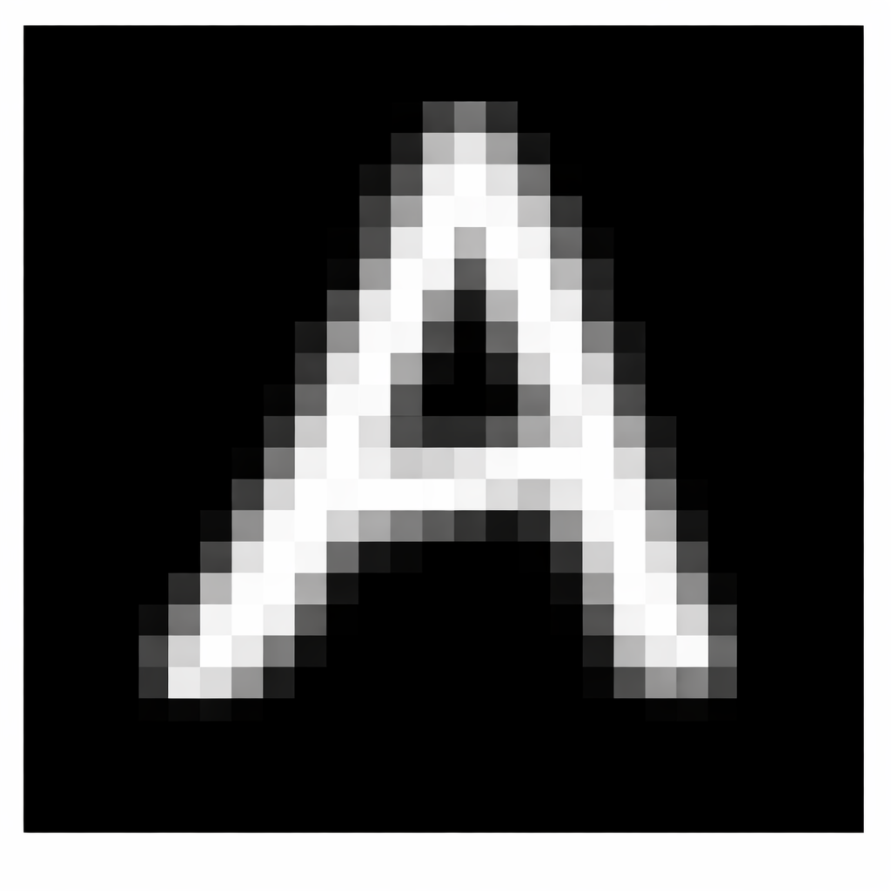

# Handwritten Character Recognition using CNN

## Project Objective

Build a deep learning system capable of recognizing **handwritten digits (0–9)** and **uppercase letters (A–Z)** from images using **Convolutional Neural Networks (CNNs)**.

This project demonstrates a practical application of computer vision and deep learning by training models on two widely used datasets.

* **MNIST** for handwritten digits
* **EMNIST** for handwritten alphabets

The system supports **command line dataset selection**, allowing users to train and perform predictions using either dataset.

---

## Technologies Used

| Category                   | Tools                           |
| -------------------------- | ------------------------------- |
| Programming Language       | Python                          |
| Deep Learning              | TensorFlow, Keras               |
| Image Processing           | Pillow                          |
| Data Processing            | NumPy                           |
| Machine Learning Utilities | scikit-learn                    |
| Dataset Loader             | tensorflow_datasets             |

---

## Project Structure

```
Handwritten_Recognition/

├── train.py
├── predict.py
├── requirements.txt
├── README.md

├── assets/
│   ├── digit.png
│   └── letter.png

├── model_mnist.keras
└── model_emnist.keras
```

| File               | Description                                        |
| ------------------ | -------------------------------------------------- |
| train.py           | Trains CNN models using MNIST or EMNIST dataset    |
| predict.py         | Predicts handwritten digits or letters from images |
| requirements.txt   | Dependency file for installing required libraries  |
| assets             | Sample input images used for predictions           |
| model_mnist.keras  | Trained digit recognition model                    |
| model_emnist.keras | Trained letter recognition model                   |

---

## Datasets

### MNIST Dataset

* 70,000 grayscale images
* Handwritten digits **0–9**
* Image size **28 × 28 pixels**

Dataset
[https://www.tensorflow.org/datasets/catalog/mnist](https://www.tensorflow.org/datasets/catalog/mnist)

---

### EMNIST Dataset

* 145,600 handwritten character images
* Covers **26 uppercase letters**
* Image size **28 × 28 pixels**

Dataset
[https://www.tensorflow.org/datasets/catalog/emnist](https://www.tensorflow.org/datasets/catalog/emnist)

---

## Model Architecture

The project uses a **Convolutional Neural Network (CNN)** designed for image classification.

```
Input (28×28×1)
    ↓
Conv2D (32 filters, 3×3 kernel) + ReLU
    ↓
MaxPooling2D (2×2)
    ↓
Dropout (0.25)
    ↓
Conv2D (64 filters, 3×3 kernel) + ReLU
    ↓
MaxPooling2D (2×2)
    ↓
Dropout (0.25)
    ↓
Flatten
    ↓
Dense (128 neurons, ReLU) + Dropout (0.5)
    ↓
Dense (10 or 26 neurons, Softmax)
```

### Key Components

| Layer        | Purpose                               |
| ------------ | ------------------------------------- |
| Conv2D       | Extracts spatial features from images |
| MaxPooling2D | Reduces dimensionality                |
| Dropout      | Prevents overfitting                  |
| Dense        | Performs classification               |
| Softmax      | Produces probability distribution     |

---

## Image Preprocessing Pipeline

Before prediction, input images undergo several preprocessing steps to match the dataset format.

1. Convert image to **grayscale**
2. Detect handwritten region using **safe border trimming**
3. Resize while **preserving aspect ratio**
4. Center the character in a **28×28 canvas**
5. Normalize pixel values to **0–1**
6. Automatically **invert colors if required**
7. Reshape image to match CNN input format

This preprocessing pipeline improves robustness for **real world handwritten inputs**.

---

## Environment Setup

### Create Virtual Environment

Windows

```
python -m venv venv
venv\Scripts\activate
```

Mac / Linux

```
python3 -m venv venv
source venv/bin/activate
```

---

## Install Dependencies

```
pip install -r requirements.txt
```

---

## Training the Model

Train digit recognition model

```
python train.py --dataset mnist
```

Train letter recognition model

```
python train.py --dataset emnist
```

Force retraining

```
python train.py --dataset emnist --force
```

### Training Behavior

* Models are saved separately for each dataset
* Training automatically skips if model already exists
* Confusion matrix is generated for evaluation

---

## Model Performance

| Dataset | Accuracy  |
| ------- | --------- |
| MNIST   | 98% – 99% |
| EMNIST  | 95% – 97% |

### Training Configuration

| Parameter        | Value                    |
| ---------------- | ------------------------ |
| Optimizer        | Adam                     |
| Loss Function    | Categorical Crossentropy |
| Epochs           | 10                       |
| Batch Size       | 32                       |
| Validation Split | 10%                      |

---

## Example Workflow

## Example Input Image



### Predict a Digit (MNIST)

```
python predict.py --dataset mnist .\assets\digit.png
```

Output

```
Loading model...
Loading image: .\assets\digit.png

Predicted Digit: 2
Confidence: 99.99%
```

---

## Example Input Image



### Predict a Letter (EMNIST)

```
python predict.py --dataset emnist .\assets\letter.png
```

Output

```
Loading model...
Loading image: .\assets\letter.png

Predicted Character: A
Confidence: 98.77%
```

---

## Prediction Safety

* Model verifies correct **number of output classes**
* Warning appears if **dataset and model mismatch**

---

## Future Improvements

Possible extensions include building a **full OCR system** capable of recognizing words and sentences.

Potential improvements

* CRNN architecture
* LSTM sequence modeling
* CTC loss for sequence prediction
* Document digitization pipelines

---

## Notes

* Model files are excluded from repository using `.gitignore`
* EMNIST images are automatically corrected for orientation
* Each dataset requires a **separate trained model**
* TensorFlow logs are suppressed for cleaner command line output

---

## Author

Developed as part of the **CodeAlpha Machine Learning Internship**

---